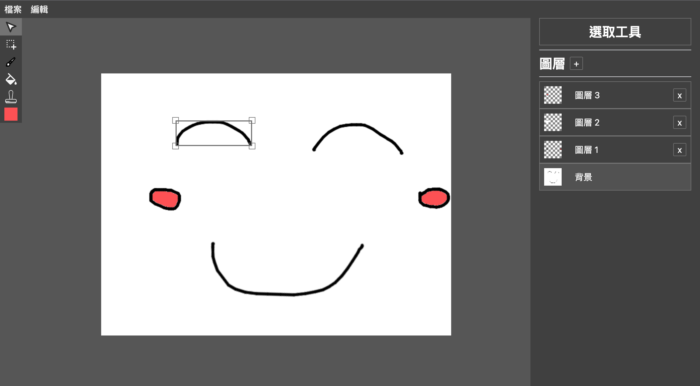

# web-image-editor

This is a web image editor, which is implemented by Vue3. [Demo](https://laijunbin.github.io/web-image-editor/)

English ｜[繁體中文](https://github.com/LaiJunBin/web-image-editor/blob/main/README-zh-tw.md#web-image-editor)

---

## Snapshot

---

## Feature

- [x] Navbar
  - [x] New project: Create new project
  - [x] Open project: Open project from local
  - [x] Save project: Save project to local
  - [x] Open image: Open image from local
  - [x] Save image: Save image to local
  - [x] Undo(ctrl+z) and redo(ctrl+y): Undo and redo action
- [x] Tools
  - [x] Brush tool: Draw on canvas
    - [x] Brush size: Change brush size
    - [x] Brush color: Change brush color
  - [x] Paint bucket: Fill color on canvas
    - [x] Paint bucket color: Change paint bucket color
  - [x] Seal: Stamp on canvas
    - [x] Seal size: Change seal size
    - [x] Seal image: Upload seal image and select it
  - [x] Selection tool: Select area on canvas, then you can ctrl+j to copy and paste it to new layer
  - [x] Cursor tool: Select object on canvas, then you can move, resize and rotate it
- [x] Filter
  - [x] Grayscale: Convert selected area to grayscale
  - [x] Invert: Convert selected area to invert
  - [x] Blur: Blur selected area
  - [x] Oil paint: Apply oil paint filter to selected area
  - [x] Black and white: Convert selected area to black and white
- [x] Layer
  - [x] Add layer: Add new layer
  - [x] Delete layer: Delete layer
  - [x] Order layer: Change layer order by drag and drop
- [x] Other
  - [x] Zoom: Hold alt and scroll mouse wheel to zoom canvas
  - [x] Drag: Hold space and left click to drag canvas

---

## Note

- If you drag the object out of the canvas, it will be deleted. You can use undo(ctrl+z) to undo it.
- Erase tool is not implemented, but you can use brush tool with the background color to erase objects.
- Operations may cause image distortion.
